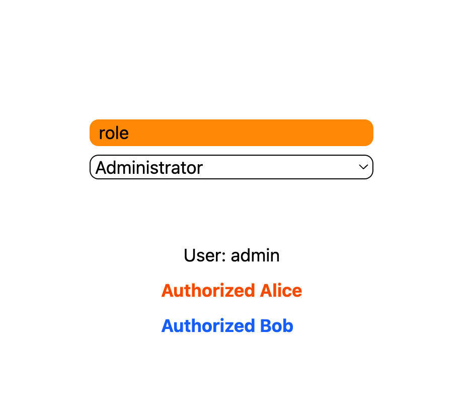

# Casbin React



## 项目简介

这是一个基于 React 和 TypeScript 的示例项目，集成了 Casbin 权限管理库。项目使用 Vite 作为构建工具，并结合 TailwindCSS 进行样式设计。

## 项目结构

```
.gitignore
eslint.config.js
index.html
package.json
pnpm-lock.yaml
README.md
shot.png
tsconfig.app.json
tsconfig.json
tsconfig.node.json
vite.config.ts
public/
    vite.svg
src/
    App.css
    App.tsx
    CasbinDemo.tsx
    main.tsx
    permissions.json
    vite-env.d.ts
    assets/
        react.svg
    components/
        Badge.tsx
        Resources.tsx
    hooks/
        useAuthStore.ts
        useFetchAuth.ts
    utils/
        mock.ts
        sleep.ts
```

- **`src/App.tsx`**: 应用的主入口组件，包含用户角色选择和权限演示。
- **`src/CasbinDemo.tsx`**: Casbin 权限管理的示例组件。
- **`src/hooks/useAuthStore.ts`**: 自定义 Hook，用于管理用户角色状态。
- **`src/hooks/useFetchAuth`**: 封装 swr hook, 用户关于异步请求状态。
- **`src/permissions.json`**: 权限配置文件。
- **`src/App.css`**: 应用的样式文件，使用 TailwindCSS。

## 快速开始

### 安装依赖

```bash
pnpm i
```

### 启动开发服务器

```bash
pnpm dev
```

### 构建项目

```bash
pnpm build
```

## 功能介绍

- 用户角色选择：支持选择不同角色（Alice、Bob、Administrator）。
- 权限管理：通过 Casbin 实现基于角色的权限控制。
- 响应式设计：使用 TailwindCSS 提供现代化的样式支持。
- 异步状态: 使用 swr 管理
- 全局状态: 使用 zustand 管理

## 技术栈

- **React**: 用于构建用户界面。
- **TypeScript**: 提供静态类型检查。
- **Vite**: 快速构建工具。
- **TailwindCSS**: 实现响应式样式设计。
- **Casbin**: 权限管理库。

## 目录说明

- **`public/`**: 静态资源文件。
- **`src/`**: 项目源代码。
  - **`components/`**: 可复用的 UI 组件。
  - **`hooks/`**: 自定义 React Hooks。
  - **`utils/`**: 工具函数。

## 截图


